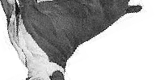
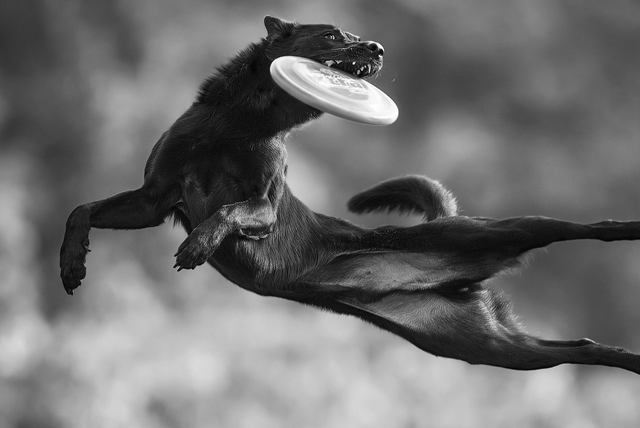
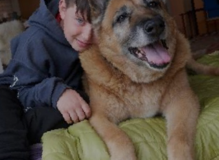
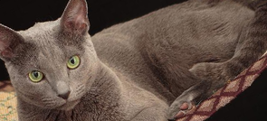
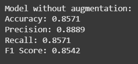
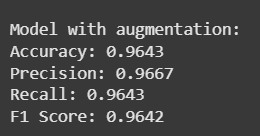

# STT_Assignment_5
This is Assignment 5 of STT. Made by Dhruv Goel(23110098) and Nitin Bansal(23110223) from Group Number 10.

## Introduction -
In this assignment we have explored the data augmentation using the Augly tool by meta.

## Procedure -
1. We were given a data of images of dogs and cats for classification.
2. We made the training and testing dataset out of it.
3. Augmented the training dataset 2 times to expand the training dataset by 3 times.
4. We used microsoft/resnet50 model for the classification. Firstly, we initialized the weights of the model.
5. Trained model once on training dataset and then again on the augemented training dataset.
6. Then tested on the test dataset.

## Augmented Images

## Results - 

